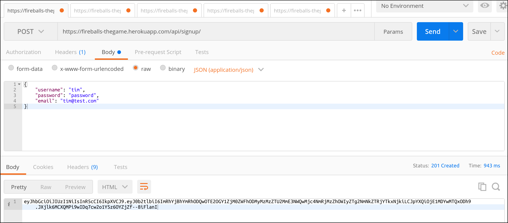
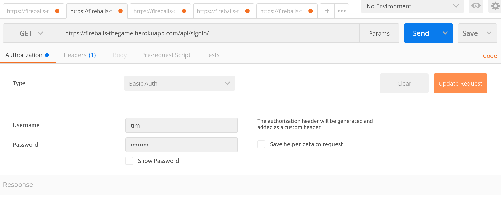
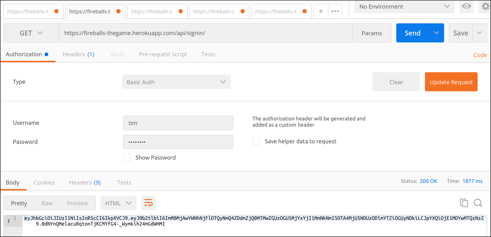
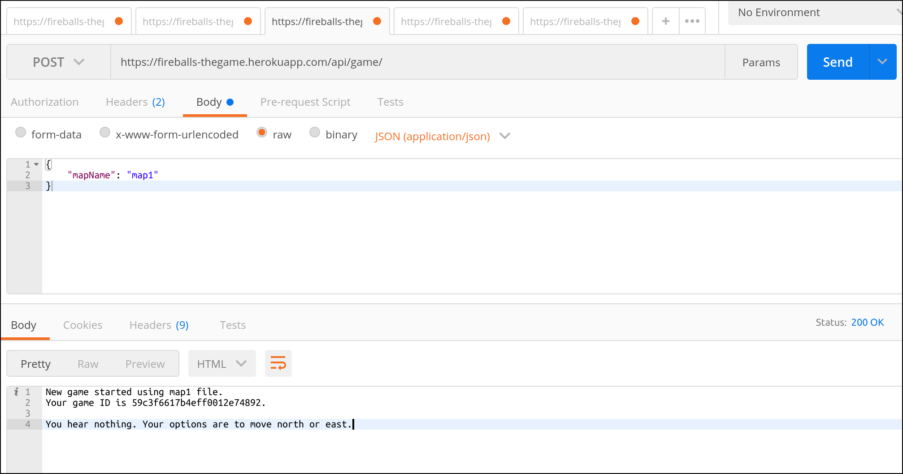
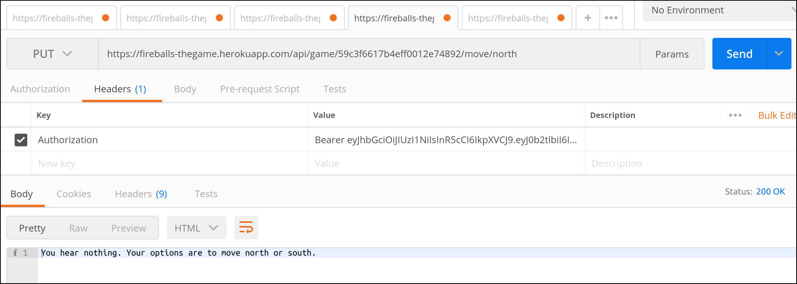
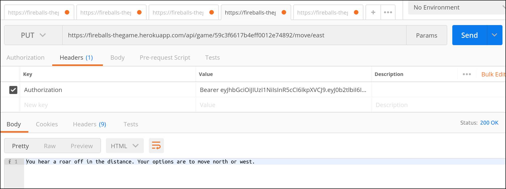
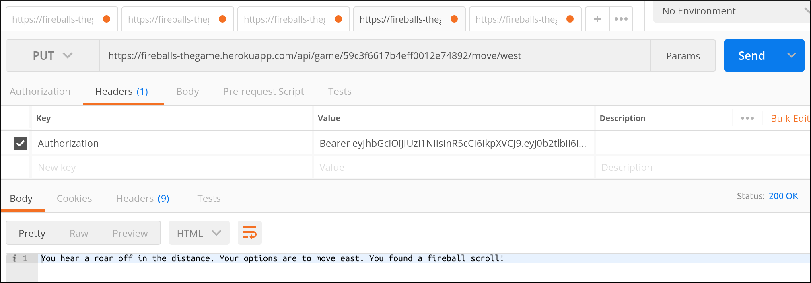

<style>
body {
    background-color: white;
}
</style>

# RESTful-API Game

![alt text][logo]
[logo]: ./img/monsters.jpg " IKST"
## Table of Content

- [About](#about)
- [Contributors](#contributors)
- [Installation](#installation)
- [Playing the Game](#playing-the-game)
- [Loading and Creating Custom Games](#loading-and-creating-custom-games)
- [License](#license)

## About

RESTful-API is a game utilizing http POST, GET, PUT and DELETES methods.  The game is an API and operates as such.  This game was designed to be played using POSTMAN to send requests and recieve a response.

[POSTMAN](https://www.getpostman.com/)

## Contributors

* [Isaac Heist](https://github.com/esack7) :neckbeard:
* [Katherine Pryszlak](https://github.com/kpryzk) :eyes:
* [Said Abdou Mattar](https://github.com/saidmattar) :finnadie:
* [Tim Turner](https://github.com/ratiphi) :smiling_imp:

## Installation

Clone or fork the project to your localhost.

Navigate to the ```RESTful-API-Game/``` directory.  Run ```npm install``` to install all package dependencies.

The required dependencies are:
- bcrypt
- bluebird
- body-parser
- cors
- dotenv
- express
- jsonwebtoken
- mongoose

Create a .env file with the following:

```
MONGODB_URI='mongodb://localhost/<name of your database>'
APP_SECRET='<a secret word>'
PORT=<a port number>
```

## Playing the Game


Your goal in this game is to find the monster and kill it.  If you move into the same room as the  monster, he will eat you!  You have to use the game play hints to figure out where the monster is located, and then attack him with a fireball.  Once you think you have found the monster, attack in the direction where you think he is located.  You have a limited number of fireballs so use them sparingly.  If you run out of fireballs, you can try to find some fireball scrolls by exploring the map.  If you run out of fireballs or move into the room with the monster in it, the game is over.  

WARNING:  If you run out of fireballs at any time, the game will immediately end.  Do not attack with only 1 fireball remaining unless you are sure you know where the monster is!!!!

#### Game play example:
The following example uses the Postman REST client to interact with the API.

:arrow_down: First, you must POST to the `/api/signup/` endpoint to create an account. Make sure to set the Content-Type to application/json in the Headers tab.


:arrow_down: Also, under the Body tab, send your `username`, `password`, and `email` as a raw JSON object.


:arrow_down: Click Send to get your API token as a response.  Copy this token to use later on your API requests to play the game.



:arrow_down: If you lose your API token, you can send a GET request to `/api/signin/` to get a new one.  Make sure to include your username and password using Basic Auth under the Authorization tab.  



:arrow_down: Click Update Request and then Send to get a response with a new token.  This new token replaces the token you received at signup.  



:arrow_down: Next, you need to create a new game.  To do this, send a POST request to `/api/game/` with your API token.  Under the Headers tab, send Authorization key with a value of `Bearer YOUR-API-TOKEN`.


:arrow_down: Under the Body tab, send the `mapName` you want to play as a raw JSON object.


:arrow_down: Click Send and your game has begun!  The response includes the `mapName` you are playing, your game ID, and your first game play hints.  Copy the game ID to use in the next step.



:arrow_down: To move into another room, send a PUT request to the `/api/game/:_id/move/:dir` endpoint.  Replace `:_id` with your game ID from the previous step and `:dir` with the direction you want to move.  Your valid options are `north`, `south`, `east`, or `west`.  Also, make sure to include `Bearer YOUR-API-TOKEN` Authorization value under the Headers tab.


:arrow_down: Click Send to move your character.  The response will include your new game play hints.  "You hear nothing" means that you are not close to the monster.



:arrow_down: Your game play hints include what directions you can move in from your current room.  To move east rather than north, change the `:dir` in `/api/game/:_id/move/:dir` from `north` to `east`.  When you see the message "You hear a roar off in the distance" you are getting closer to the monster!



:arrow_down: When you see the message "You hear a loud roar!" you are in a room directly adjacent to the monster!  Remember, if you move into the room with the monster, he will eat you!  Be careful!!


:arrow_down: Running low on fireballs?  Explore to find more ammunition! When you see the message "You found a fireball scroll!" your fireball count goes up by 1.  



:arrow_down: If you think you have located the monster, throw a fireball at him by sending a PUT request to the `/api/game/:_id/attack/:dir` endpoint. Replace `:_id` with your game ID and `:dir` with the direction you want to attack.  Your valid options are `north`, `south`, `east`, or `west`.


:arrow_down: If you successfully attack the monster with a fireball, he will die!  Remember, you have a limited number of fireballs.  The game is now over.  To play again, send another POST request to `/api/game/` with your API token.


## Loading and Creating Custom Games

### <a name="packages"></a>Packages and commands to remember:

#### For Mongo:
- npm install mongodb into your project directory (To install Mongo) -
- mongod (To start the MongoDB process)
- mongo (To start the MongoDB shell-- )

#### General:
  - In package.json's scripts, add- "start:debug": "DEBUG=http* nodemon server.js",
  - npm install express -
  - npm i or npm install (For node modules) -

###### HTTP requests:
  - node server.js or just nodemon (to start a command line server) -
  - rs (restart, if needed)
  - ^C (control-C to stop node server)
  - npm install httpie (A command line HTTP client, to be able to test making http requests. An alternative is postman.)
  - npm install superagent (To be able to make http requests) -
  - npm install uuid (For creating unique user ids) -
  - npm install -D jest (To be able to run tests) -
    - npm test (To actually run the jest test)

###### TESTS:
  - npm run start:watch (This option won't tell what is wrong with your code) -
  - npm run start:debug - (Then attempt a POST and this option will tell you where you are wrong)
  - npm run debugger (Not sure what makes this one different or special yet...)-


- Created a .env file with the following:

```
MONGODB_URI='mongodb://localhost/<name of your database>'
APP_SECRET='<a secret word>'
PORT=<a port number>
```

- In package.json, within scripts add the '--runInBand' to the 'test: jest.' This will make sure all tests run sequentially.
```
"test": "jest --runInBand",
```
- Create a `.env` & `.test.env` files

- Adde multer to package.json
- Adde a .travis.yml file

- In server.js we 'server.stop = () => {'' the server and .close() the mongoConnection.

## License

The RESTful-API Game is licensed under the terms of MIT license and is free to be used.
